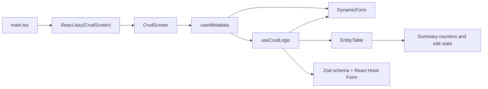

# Metadata-Driven User CRUD

This project is a Vite + React + TypeScript CRUD demo that generates its user management UI from a single metadata contract. The milestone 3 work adds AI-assisted documentation, dependency mapping, Playwright E2E coverage, Lighthouse automation, and bundle optimization evidence.

## Setup

```bash
npm install
```

Use these commands during development:

| Script | Purpose |
| --- | --- |
| `npm run dev` | Start the local Vite development server. |
| `npm run lint` | Run the flat ESLint configuration for the app and TypeScript config files. |
| `npm run typecheck` | Run the TypeScript project references without producing build output. |
| `npm run build` | Create a production build with manual chunking enabled. |
| `npm run preview` | Preview the production build locally. |
| `npm run test` | Run the Vitest suite. |
| `npm run test:e2e` | Run the Playwright E2E suite against the local app. |
| `npm run build:analyze` | Build the app and print a bundle-size report. |
| `npm run audit:lighthouse -- --outputDir ./output/lighthouse --label local` | Build the app, serve `dist`, run Lighthouse, and save HTML/JSON reports. |
| `npm run capture:app -- --outDir ./output/playwright` | Capture deterministic app screenshots for documentation. |

## Usage

The screen ships with seeded records for Ada Lovelace, Grace Hopper, and Alan Turing. Use the metadata-driven form to:

- create a user with name, email, role, and active status
- edit an existing record with a simulated one-second API delay
- delete records and verify the empty state
- validate required fields and email formatting without duplicating validation logic outside the metadata contract

## Architecture Overview

The application is intentionally small, but the responsibilities stay separated:

- `src/main.tsx` lazy-loads the CRUD feature and renders a lightweight fallback while the feature chunk loads.
- `src/features/user-crud/CrudScreen.tsx` owns the screen-level composition and the metadata contract.
- `src/features/user-crud/useCrudLogic.ts` generates Zod validation, default values, CRUD state, and mock persistence behavior.
- `src/features/user-crud/DynamicForm.tsx` maps metadata into accessible form controls.
- `src/features/user-crud/EntityTable.tsx` renders responsive record views for mobile and desktop layouts.



## Dependency Map Summary

The import graph is centered on a single feature slice:

| Module | Depends On | Why It Exists |
| --- | --- | --- |
| `src/main.tsx` | `react`, `react-dom`, `CrudScreen`, `styles.css` | Bootstraps the app and lazy-loads the feature. |
| `CrudScreen.tsx` | `DynamicForm`, `EntityTable`, `types.ts`, `useCrudLogic.ts` | Composes the feature and injects metadata. |
| `DynamicForm.tsx` | `react-hook-form`, `types.ts` | Renders metadata into accessible inputs. |
| `EntityTable.tsx` | `types.ts` | Displays users as cards or rows. |
| `useCrudLogic.ts` | `react`, `react-hook-form`, `@hookform/resolvers`, `zod`, `types.ts` | Encapsulates validation, edit state, and mock persistence. |

For the full dependency map and Mermaid import graph, see [Architecture_Dependency_Map.md](/Users/jyotirsolanki/Development/RTBGenAI/capstoneProject/docs/Architecture_Dependency_Map.md).

## Testing Workflow

- Unit coverage lives in [CrudScreen.test.tsx](/Users/jyotirsolanki/Development/RTBGenAI/capstoneProject/src/features/user-crud/CrudScreen.test.tsx) and exercises render, validation, create, edit, cancel, delete, empty-state, and status-toggle flows.
- E2E coverage lives in [crud-flow.spec.ts](/Users/jyotirsolanki/Development/RTBGenAI/capstoneProject/e2e/crud-flow.spec.ts) and validates the real browser flow plus a mobile smoke pass.
- Global test setup lives in [setup.ts](/Users/jyotirsolanki/Development/RTBGenAI/capstoneProject/src/test/setup.ts) and stubs browser APIs required by jsdom.

## Performance and Audit Workflow

The milestone 3 performance pass focuses on reducing initial JavaScript and making audits repeatable:

- `src/main.tsx` now lazy-loads the CRUD feature behind a loading shell.
- `vite.config.ts` splits React and form-validation libraries into separate vendor chunks.
- `DynamicForm.tsx` uses a native checkbox-based toggle instead of the heavier Radix switch dependency.
- `scripts/write-bundle-report.mjs` generates repeatable bundle reports from `dist/assets`.
- `scripts/run-lighthouse.mjs` wraps Lighthouse so reports can be saved directly into the milestone evidence folders.

The reusable PR summary format for this project lives in [PR_Summary_Template.md](/Users/jyotirsolanki/Development/RTBGenAI/capstoneProject/docs/PR_Summary_Template.md).

## Docker and CI

- `Dockerfile` uses a multi-stage build: Node 20 builds the app and unprivileged Nginx serves the compiled SPA on port `8080`.
- `nginx/default.conf` handles SPA fallback routing with `try_files`, disables caching for `index.html`, and marks hashed assets as immutable.
- `.github/workflows/frontend-pr-validation.yml` validates pull requests to `main` with dependency caching, linting, type-checking, unit tests, production build creation, Docker build smoke validation, and `dist` artifact upload.
- Sensitive values are intentionally excluded from source control; any future deployment or registry integration should read tokens from GitHub Secrets rather than workflow YAML.
