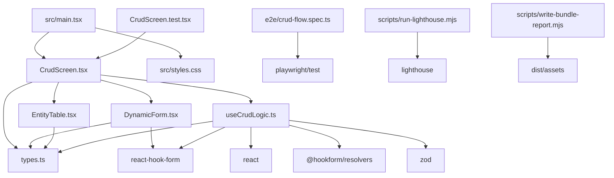

# Architecture and Dependency Map

This document validates the project structure against the current import graph in `src/`, `e2e/`, and `scripts/`.

## Structured Dependency Map

| Module | Direct Dependencies | Shared Utilities / External Libraries | Responsibility |
| --- | --- | --- | --- |
| `src/main.tsx` | `CrudScreen`, `styles.css` | `react`, `react-dom` | Bootstraps the app and lazy-loads the feature entry. |
| `src/features/user-crud/CrudScreen.tsx` | `DynamicForm`, `EntityTable`, `types.ts`, `useCrudLogic.ts` | none | Declares metadata and composes the page layout. |
| `src/features/user-crud/DynamicForm.tsx` | `types.ts` | `react-hook-form` | Maps metadata into text, email, select, and checkbox controls. |
| `src/features/user-crud/EntityTable.tsx` | `types.ts` | none | Displays current records as cards and a desktop table. |
| `src/features/user-crud/useCrudLogic.ts` | `types.ts` | `react`, `react-hook-form`, `@hookform/resolvers`, `zod` | Builds schema/defaults and manages create, edit, delete, and reset state. |
| `src/features/user-crud/types.ts` | none | none | Centralizes metadata, form, and record typing. |
| `src/features/user-crud/CrudScreen.test.tsx` | `CrudScreen.tsx` | `@testing-library/react`, `@testing-library/user-event`, `vitest` | Covers feature behavior in jsdom. |
| `e2e/crud-flow.spec.ts` | none | `playwright/test` | Validates the real browser flow and mobile smoke behavior. |
| `scripts/run-lighthouse.mjs` | none | `lighthouse` via `npx` | Saves repeatable before/after Lighthouse reports. |
| `scripts/write-bundle-report.mjs` | none | Node built-ins | Writes structured bundle-size summaries from the build output. |

## Dependency Graph

## Architecture Notes

- The metadata object in `CrudScreen.tsx` remains the single contract for field rendering, defaults, and validation.
- `useCrudLogic.ts` is the only module that knows about create/edit/delete state transitions and the mock API delay.
- `DynamicForm.tsx` and `EntityTable.tsx` stay focused on rendering; neither module owns persistence or validation rules.
- Test and audit tooling stay outside the feature slice so the production bundle only contains application code.
