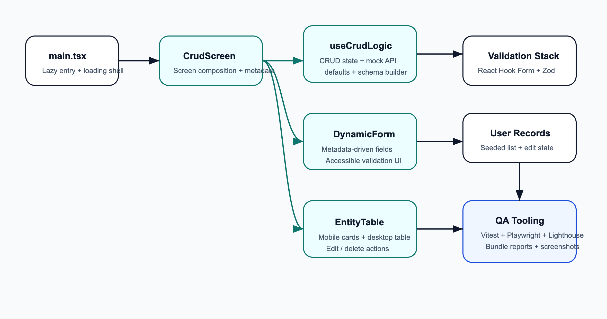
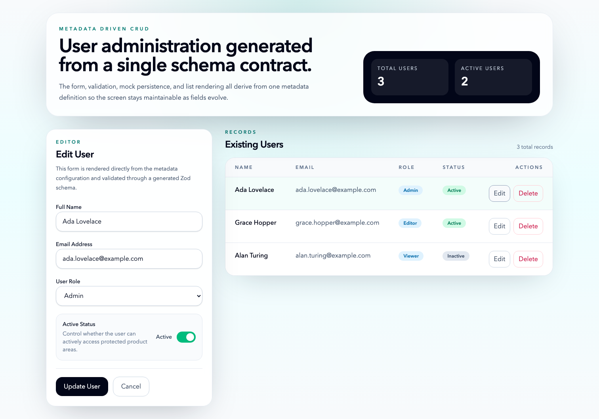
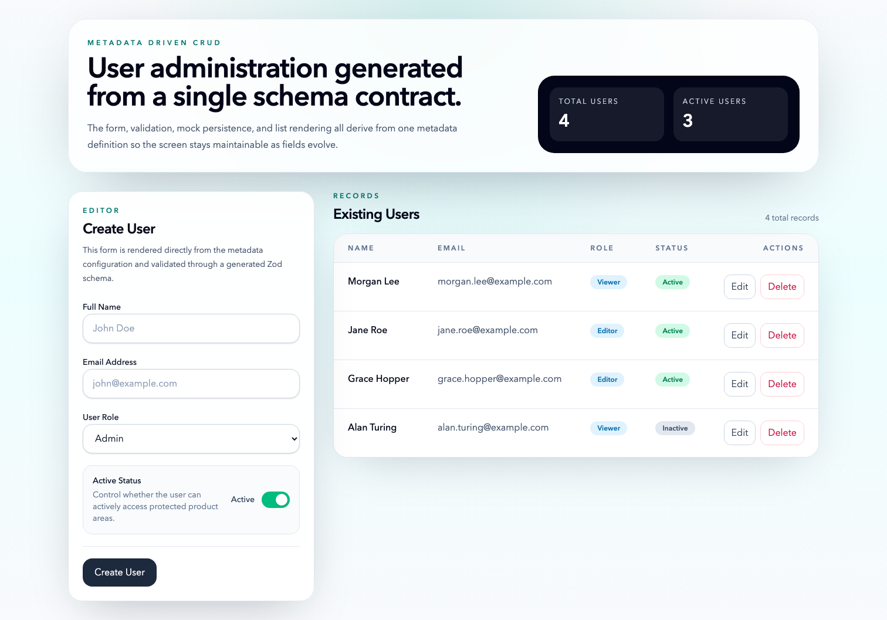

# AI-Assisted QA & Optimization Report

Date: March 19, 2026

## Objective

This milestone demonstrates how AI can be used to document, validate, optimize, and summarize a frontend application. The target application is the metadata-driven React CRUD screen in `capstoneProject`.

## Current Project Context

- App type: Vite + React 18 + TypeScript single-screen CRUD demo
- Core feature: metadata-driven user creation, editing, validation, and deletion
- Validation stack: React Hook Form + Zod
- Test stack after this milestone: Vitest + Playwright
- Audit stack after this milestone: Lighthouse + custom bundle report scripts

## Original Assignment Prompt

```text
in the capstone project inside this folder , your task is to do below tasks:
Hands-On Tasks

1. Generate Documentation (JSDoc / README)
Goal: Reduce manual effort in code documentation
	•	Generate JSDoc comments for existing functions
	•	Create a complete README (setup, usage, architecture overview)
	•	Review and refine AI-generated documentation

2. Summarize PR Changes
Goal: Improve team communication using AI summaries
	•	Generate summaries from PR diffs
	•	Include impact, risks, and testing instructions
	•	Format into a reusable PR template

3. Generate Dependency Map
Goal: Understand complex codebases faster
	•	Analyze project structure using AI
	•	Identify module dependencies and shared utilities
	•	Produce a structured dependency map

4. Create Architecture Diagram
Goal: Visualize component relationships and flow
	•	Generate system design from codebase
	•	Convert into diagram (Mermaid / Figma / draw.io)
	•	Validate against actual implementation

5. Generate Unit + E2E Tests
Goal: Automate test coverage creation
	•	Generate unit tests for key components
	•	Create E2E test scenarios
	•	Validate and fix generated tests

6. Fix Lighthouse Issues via AI
Goal: Learn to interpret reports and apply fixes
	•	Run Lighthouse audit
	•	Use AI to explain issues
	•	Implement fixes and measure improvements

7. Optimize Bundle & Lazy Loading
Goal: Improve application performance
	•	Identify large bundles and unused code
	•	Implement code splitting and lazy loading
	•	Verify bundle size reduction

8. Analyze Performance Reports
Goal: Prioritize optimization efforts effectively
	•	Analyze Lighthouse / Web Vitals / DevTools reports
	•	Use AI to suggest improvements
	•	Rank fixes based on impact vs effort

Deliverable

AI-Assisted QA & Optimization Report

Goal: Demonstrate ability to analyze, improve, and validate application quality using AI

Deliverable Includes:
	•	Generated documentation (JSDoc + README)
	•	PR summaries
	•	Dependency map
	•	Architecture diagram
	•	Unit and E2E test cases
	•	Lighthouse report (before vs after improvements)
	•	Performance optimization summary (bundle size, load time, key fixes)

Document everything that you will do in docsmilestone3 with proofs or screenshots of deliverables, include original prompt also, you can reference docsmilestone2
```

## Prompt Log

The task-specific AI prompts used during execution are recorded in [assets/prompts/ai-prompts.md](assets/prompts/ai-prompts.md).

## Work Log

1. Inspected the repository and confirmed the target app lived in `capstoneProject`, with milestone 2 artifacts available for reference in `docsmilestone2`.
2. Captured a clean baseline before changing application code: unit test log, production build log, build snapshot, browser screenshots, and a Lighthouse report.
3. Added JSDoc to the exported types, components, hook, and non-trivial helper functions in the CRUD feature.
4. Created a project README, an architecture/dependency document, and a reusable PR summary template.
5. Expanded unit coverage for invalid input, inactive-user creation, cancel/reset, and empty-state behavior.
6. Added Playwright E2E coverage for load, create, update, delete, validation, and a mobile smoke test.
7. Added reusable scripts for screenshot capture, Lighthouse execution, and bundle analysis.
8. Optimized the production bundle by replacing the Radix switch with a native checkbox toggle, lazy-loading the feature entry, preloading the lazy chunk, and enabling manual vendor chunk splitting in Vite.
9. Added document metadata in `index.html` to address SEO gaps discovered in the Lighthouse baseline.
10. Reran the full validation loop after the changes and saved the resulting evidence into `docsmilestone3/assets/`.

## Generated Documentation

### JSDoc

JSDoc was added to:

- `capstoneProject/src/features/user-crud/types.ts`
- `capstoneProject/src/features/user-crud/useCrudLogic.ts`
- `capstoneProject/src/features/user-crud/DynamicForm.tsx`
- `capstoneProject/src/features/user-crud/EntityTable.tsx`
- `capstoneProject/src/features/user-crud/CrudScreen.tsx`

The comments document the metadata contracts, hook return shape, schema/default builders, state helpers, and the purpose of the major UI components.

### README

The canonical project README is now in [../capstoneProject/README.md](../capstoneProject/README.md). It includes:

- setup and script usage
- feature usage notes
- architecture overview
- dependency map summary
- Mermaid architecture diagram
- testing workflow
- Lighthouse and bundle-analysis workflow

## PR Summary

The reusable template lives in [../capstoneProject/docs/PR_Summary_Template.md](../capstoneProject/docs/PR_Summary_Template.md). The concrete milestone summary is stored in [assets/PR_Summary_Milestone3.md](assets/PR_Summary_Milestone3.md).

### Generated Summary

**Summary**

This change turns the CRUD demo into a repeatable QA and optimization exercise by adding code documentation, a README, dependency/architecture docs, unit and E2E coverage, Lighthouse and bundle-report automation, and a milestone evidence pack.

**Impact**

- Documentation is now available both in code and in project-level docs.
- QA workflows are repeatable through `npm run test`, `npm run test:e2e`, `npm run capture:app`, and `npm run audit:lighthouse`.
- The production bundle is split into cacheable chunks, the main feature is lazy-loaded, and SEO metadata is now present in `index.html`.

**Risks**

- The app now depends on a lazy-loaded feature chunk and a local Chrome installation for the audit automation.
- Manual chunking changes production asset names and increases the number of files in `dist/assets`.

**Testing Instructions**

- `npm run test`
- `npm run test:e2e`
- `npm run build`
- `node ./scripts/write-bundle-report.mjs --sourceDir ./dist/assets`
- `npm run audit:lighthouse -- --outputDir ./output/lighthouse --label pr`

## Dependency Map

The validated dependency document lives in [../capstoneProject/docs/Architecture_Dependency_Map.md](../capstoneProject/docs/Architecture_Dependency_Map.md).

### Structured Summary

| Module | Direct Dependencies | Responsibility |
| --- | --- | --- |
| `src/main.tsx` | `CrudScreen`, `styles.css`, `react`, `react-dom` | Bootstraps the app and lazy-loads the feature entry. |
| `CrudScreen.tsx` | `DynamicForm`, `EntityTable`, `types.ts`, `useCrudLogic.ts` | Declares metadata and composes the screen. |
| `DynamicForm.tsx` | `types.ts`, `react-hook-form` | Maps metadata into accessible inputs. |
| `EntityTable.tsx` | `types.ts` | Displays current records as cards and table rows. |
| `useCrudLogic.ts` | `react`, `react-hook-form`, `@hookform/resolvers`, `zod`, `types.ts` | Builds validation, defaults, and CRUD state. |

### Mermaid Source

The Mermaid dependency graph source is stored in [assets/diagrams/dependency-map.mmd](assets/diagrams/dependency-map.mmd).

## Architecture Diagram

The Mermaid source of the architecture diagram is stored in [assets/diagrams/architecture-overview.mmd](assets/diagrams/architecture-overview.mmd). A rendered SVG was created for export-friendly documentation.



## Unit and E2E Test Cases

### Unit Coverage

Unit coverage now validates:

- seeded render state
- required-field validation
- trimmed name and invalid-email validation
- create flow
- inactive-status create flow
- update flow
- cancel/reset behavior
- empty-state rendering after deletes

Proof: [assets/final/logs/npm-test.txt](assets/final/logs/npm-test.txt)

### E2E Coverage

Playwright E2E coverage now validates:

- application load
- create flow
- update flow
- delete flow
- validation error path
- mobile-card layout smoke test

Proof: [assets/final/logs/npm-test-e2e.txt](assets/final/logs/npm-test-e2e.txt)

## Screenshots of Deliverables

### Final Dashboard


### Final Edit Mode



### Final Created Record State



## Lighthouse Report: Before vs After

Baseline artifacts:

- HTML: [assets/baseline/lighthouse/baseline-audit.report.html](assets/baseline/lighthouse/baseline-audit.report.html)
- JSON: [assets/baseline/lighthouse/baseline-audit.report.json](assets/baseline/lighthouse/baseline-audit.report.json)

Final artifacts:

- HTML: [assets/final/lighthouse/final-audit.report.html](assets/final/lighthouse/final-audit.report.html)
- JSON: [assets/final/lighthouse/final-audit.report.json](assets/final/lighthouse/final-audit.report.json)

### Category Scores

| Category | Baseline | Final | Change |
| --- | ---: | ---: | ---: |
| Performance | 95 | 95 | 0 |
| Accessibility | 100 | 100 | 0 |
| Best Practices | 96 | 96 | 0 |
| SEO | 90 | 100 | +10 |

### Key Metrics

| Metric | Baseline | Final |
| --- | --- | --- |
| First Contentful Paint | 2.3 s | 2.3 s |
| Largest Contentful Paint | 2.4 s | 2.4 s |
| Speed Index | 2.3 s | 2.3 s |
| Total Blocking Time | 0 ms | 0 ms |
| Interactive | 2.4 s | 2.4 s |

### AI-Assisted Interpretation

- The baseline report already had strong performance, accessibility, and best-practices scores, so the most actionable issue was SEO metadata completeness.
- The largest JavaScript opportunity in the baseline was a single monolithic `index` bundle with `129,043` unused bytes.
- After the optimization pass, the app still scored `95` for performance, but the unused JavaScript opportunity was split across `form-vendor` and `react-vendor`, reducing combined wasted bytes to `116,335`.
- Adding a description and theme metadata closed the SEO gap and raised the SEO score from `90` to `100`.

Proof summaries:

- Baseline summary: [assets/baseline/lighthouse/summary.json](assets/baseline/lighthouse/summary.json)
- Final summary: [assets/final/lighthouse/summary.json](assets/final/lighthouse/summary.json)

## Performance Optimization Summary

### Bundle Comparison

| Measure | Baseline | Final | Change |
| --- | ---: | ---: | ---: |
| Total raw assets | 268.57 kB | 266.13 kB | -2.44 kB |
| Total gzip assets | 82.14 kB | 81.39 kB | -0.75 kB |
| Largest JS file | 246.48 kB | 134.58 kB | -111.90 kB |
| Number of JS files | 1 | 5 | +4 |

### Key Fixes

- Replaced `@radix-ui/react-switch` with a native checkbox-based toggle to remove a production dependency that was heavy for this small use case.
- Lazy-loaded `CrudScreen` from `main.tsx` and preloaded the lazy chunk so the feature still loads quickly.
- Split the build into `react-vendor`, `form-vendor`, `app-vendor`, and feature-specific chunks through Vite `manualChunks`.
- Added a bundle-report script so future comparisons can be rerun directly against `dist/assets`.

### Evidence

- Baseline bundle report: [assets/baseline/bundle/bundle-report.md](assets/baseline/bundle/bundle-report.md)
- Final bundle report: [assets/final/bundle/bundle-report.md](assets/final/bundle/bundle-report.md)

## Validation Results

| Command | Result |
| --- | --- |
| `npm run test` | Passed: 8 tests |
| `npm run test:e2e` | Passed: 6 tests |
| `npm run build` | Passed |
| `npm run audit:lighthouse` | Passed |

Supporting files:

- Unit log: [assets/final/logs/npm-test.txt](assets/final/logs/npm-test.txt)
- E2E log: [assets/final/logs/npm-test-e2e.txt](assets/final/logs/npm-test-e2e.txt)
- Build log: [assets/final/logs/npm-build.txt](assets/final/logs/npm-build.txt)
- Playwright HTML report: [assets/final/logs/playwright-report/index.html](assets/final/logs/playwright-report/index.html)

## Remaining Risks and Follow-Up Ideas

- The form-validation vendor chunk is still the largest JS opportunity because the app is intentionally small and ships form + validation logic to the client.
- Lighthouse automation assumes a locally installed Chrome binary. If the environment changes, `CHROME_PATH` should be set explicitly.
- The app has a single feature route, so bundle splitting mostly improves cacheability and audit transparency rather than dramatically lowering total transferred bytes.
