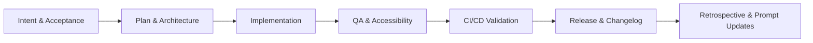

# AI-Augmented Frontend Engineer Workflow

## Lifecycle Overview



### 1. Intent and Acceptance

- Translate the feature request into user outcomes, constraints, and non-goals.
- Use AI to draft acceptance criteria, then have a human confirm edge cases and scope boundaries.

### 2. Plan and Architecture

- Ask AI for interface options, dependency impact, and rollout risks.
- Human reviewer selects the approach, validates data flow, and rejects unnecessary abstraction.

### 3. Implementation

- Use AI to scaffold modules, tests, and typed contracts.
- Human engineer keeps ownership of architecture, naming, and business correctness.

### 4. QA and Accessibility

- Use AI to generate test cases, PR review checklists, and accessibility audits.
- Human validates keyboard flows, semantics, and real browser behavior.

### 5. CI/CD Validation

- AI can draft Docker, Nginx, and GitHub Actions config.
- Human verifies secrets handling, permissions, cache strategy, and deployment assumptions.

### 6. Release and Learning Loop

- AI drafts changelog entries, post-release summaries, and follow-up tasks.
- Human approves the release note, confirms metrics, and updates the prompt library based on what worked.

## Golden Prompt Vault

### Code Prompt

```text
Implement the change in a React + TypeScript + Vite codebase.

Constraints:
- no `any`
- keep code modular and Single Responsibility oriented
- prefer pure helpers for business logic
- add or update tests when behavior changes
- do not invent APIs or data the repo does not already support

Output:
- code changes
- updated tests
- brief rationale
- validation commands run
```

Human check:

- confirm the generated abstractions are justified
- reject dead code and speculative extension points

### UI Prompt

```text
Design or refine a frontend screen for the existing design language.

Constraints:
- preserve accessibility first
- use semantic HTML before ARIA
- avoid generic layouts and unnecessary component nesting
- keep responsive behavior explicit
- explain any performance tradeoff created by the UI choice

Output:
- component structure
- styling rationale
- accessibility notes
- mobile and desktop behavior
```

Human check:

- tab through the interface
- verify labels, headings, and focus behavior in the browser

### QA Prompt

```text
Review this diff as a senior frontend QA engineer.

Focus:
- component composability
- state management efficiency
- accessibility gaps
- unnecessary re-renders

Output:
- findings only
- severity-ordered
- file/line references
- test impact for each issue
```

Human check:

- reproduce all high-severity findings locally
- reject low-signal comments that are not tied to real risk

### DevOps Prompt

```text
Create production-ready Docker, Nginx, and GitHub Actions config for this frontend app.

Constraints:
- Node 20+ build stage
- non-root runtime
- no hardcoded secrets
- least-privilege workflow permissions
- dependency caching
- lint, typecheck, test, build, and container smoke validation

Output:
- Dockerfile
- Nginx config
- CI workflow YAML
- security rationale
```

Human check:

- verify the runtime user is not root
- verify secrets come only from platform secret stores
- verify workflow permissions are minimal

## Governance

### Human-in-the-Loop Rules

- AI may propose code, tests, UI, and infrastructure, but a human must approve architecture and production-facing configuration.
- Every AI-generated change must be validated by at least one executable check: lint, type-check, tests, build, audit, or deployment smoke test.
- AI outputs that cite metrics must link back to a source artifact or command output.
- No PR merges on AI confidence alone; merge decisions require human review of risk and scope.

### Security Rules

- Never place tokens, passwords, or environment secrets in source files or workflow YAML.
- Prefer read-only workflow permissions by default.
- Use non-root runtime containers.
- Review third-party action usage before adopting new CI steps.
- Treat AI-suggested shell commands as untrusted until inspected.

## Constraint Checklist

- No `any` types in TypeScript.
- No hardcoded secrets in YAML or docs.
- Docker runtime must be non-root.
- Config and code should stay modular and Single Responsibility oriented.
- Generated tests and review comments must be tied to real repo behavior.
- Metrics used in docs must trace back to stored evidence.

